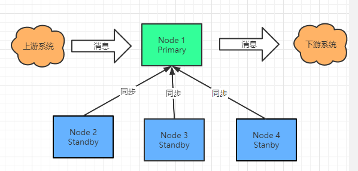
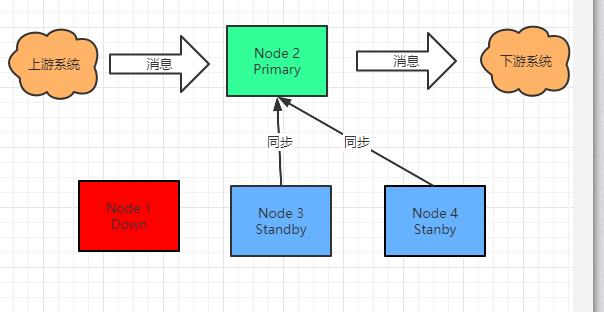

## 前言

最近公司的项目里在实现高可用时HA时，部署了多个节点，但这部署的节点不能同时工作，集群里只有一个节点作为主节点进行作业，别的节点只能是作为从节点，对主节点的消息数据进行实时的复制，当主节点出现宕机时，将会多个从节点会选举出一个从节点作为主节点，其他从节点开始从新的主节点开始同步数据。

大概的构架图：



出现Fail Over 后如下图：



Node1 节点宕机后，Node2 被选举成为 Primary 基其他节点对 Node2 节点进行数据两步。

从功能的需求上能想到，要实现这个功能需要解决以下两个问题

* Primary 选举机制，主节点宕机后，从节点有一个被选 出来当主节点。
* 当主节点进行变更后，其他节点需要被通知，主节点变更事件，从而更新数据同步策略。

## 实现

将使用 `Apache Curator` 的两个组件来实现，通过 LeaderSelector 来实现主节点选举，这个组件只提供选举功能，并不支持主节点变更事件，所以如果只用这个组件，其中一个节点成为了主节点，从节点毫无感知，所以这个时候就用到它的另一个组件`NodeCache`  , 这个组件从名字了解，它是一个缓存用的，其实里面最实用的功能是监听，就是它能监听节点的变化，提供回调事件， 具体实现如下：

1. 实现 Primary 节点选举

```
public class MyLeaderSelectorClient {

    private static final Logger logger = LoggerFactory.getLogger(MyLeaderSelectorClient.class);
    private String hostId;
    public static final String leaderInfoPath = "/test/leader";
    private String leaderSelectorPath = "/test/selector";
    private CuratorFramework client;
    private LeaderSelector leaderSelector;

    public MyLeaderSelectorClient(String hostId) {
        this.hostId = hostId;
    }

    public void start() throws Exception {

        client = CuratorFrameworkFactory.newClient("localhost:2181", new RetryForever(100));
        client.start();

        logger.info("leader selector start");
        leaderSelector = new LeaderSelector(client, leaderSelectorPath, new LeaderSelectorListenerAdapter() {
            @Override
            public void takeLeadership(CuratorFramework curatorFramework) throws Exception {
                logger.info("Host[{}] is taking leader ship ", hostId);
                
                //更新当前节点信息到ZK
                updatePrimaryInfoToZK();
                
                logger.info("Host[{}] is doing something...", hostId);
                TimeUnit.DAYS.sleep(1);
                
                logger.info("Host[{}] end taking leader ship", hostId);
            }
        });

        leaderSelector.setId(hostId);
        leaderSelector.start();
        leaderSelector.autoRequeue();
        logger.info("leader selector started and auto requeue");
        
        //启动 Primary 节点监听
        PrimaryListener primaryListener = new PrimaryListener(client, hostId);
        primaryListener.start();
        logger.info("Primary listener started");
    }

    private void updatePrimaryInfoToZK() throws Exception {
        client.create()
                .orSetData()
                .creatingParentContainersIfNeeded()
                .withMode(CreateMode.EPHEMERAL)
                .forPath(leaderInfoPath, hostId.getBytes());
    }

    public void close(){
        leaderSelector.close();
        client.close();
    }
}

```

2. 实现 Primary 节点变化监听

   ```
   public class PrimaryListener {
       private static final Logger LOGGER = LoggerFactory.getLogger(PrimaryListener.class);
       private NodeCache nodeCache;
       private String hostId;
       private CuratorFramework client;
   
       public PrimaryListener(CuratorFramework client, String hostId) {
           this.client = client;
           this.hostId = hostId;
       }
   
       public void start() throws Exception {
           nodeCache = new NodeCache(client, leaderInfoPath);
           nodeCache.getListenable().addListener(this::primaryChanged);
           nodeCache.start();
       }
   
       private void primaryChanged() {
           LOGGER.info("found primary changed!");
           ChildData currentData = nodeCache.getCurrentData();
           if (currentData != null ) {
               String newPrimary = new String(currentData.getData());
               if(!hostId.equals(newPrimary)){
                   LOGGER.info("Host[{}] will follow the new primary[{}]", hostId, newPrimary);
               }
           }
       }
   }
   
   ```

   

效果如下：

```

21:21:18.685 [main] INFO com.powerjun.curator.MyLeaderSelectorClient - leader selector started and auto requeue
21:21:18.726 [main] INFO com.powerjun.curator.MyLeaderSelectorClient - Primary listener started 
21:21:18.762 [main-EventThread] INFO com.powerjun.curator.PrimaryListener - found primary changed!
21:21:18.762 [main-EventThread] INFO com.powerjun.curator.PrimaryListener - Host[2] will follow the new primary[1]
21:21:38.891 [Curator-LeaderSelector-0] INFO com.powerjun.curator.MyLeaderSelectorClient - Host[2] is taking leader ship 
21:21:38.939 [main-EventThread] INFO com.powerjun.curator.PrimaryListener - found primary changed!
```

这个节点2 的日志，从一开始Follow 节点1，当主节点节点1宕机后，自己则成为主节点

```
 leader selector started and auto requeue
21:21:27.233 [main] INFO com.powerjun.curator.MyLeaderSelectorClient - Primary listener started
21:21:27.273 [main-EventThread] INFO com.powerjun.curator.PrimaryListener - found primary changed!
21:21:27.273 [main-EventThread] INFO com.powerjun.curator.PrimaryListener - Host[3] will follow the new primary[1]
21:21:38.945 [main-EventThread] INFO com.powerjun.curator.PrimaryListener - found primary changed!
21:21:38.945 [main-EventThread] INFO com.powerjun.curator.PrimaryListener - Host[3] will follow the new primary[2]
```

这是节点3 的日志，它能监听到主节点从节点1 变成节点2
